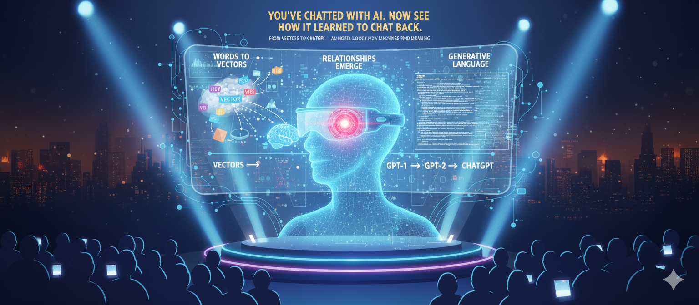

# From Vectors to ChatGPT

### *The Building Blocks of Generative AI*

**Wolf Paulus – Embry-Riddle Aeronautical University, October 2025**

---

## Overview

This repository accompanies the talk
**“From Vectors to ChatGPT – The Building Blocks of Generative AI”**,
presented at **Embry-Riddle Aeronautical University (ERAU)** for first-year engineering students.

The session demonstrates how *simple math, data structures, and a few lines of Python* form the foundation of systems like ChatGPT.

It is designed to be **visual, accessible, and hands-on**, helping students connect engineering fundamentals to modern AI.

---

## What You'll Learn

- How **language can be represented as numbers** (vectors & embeddings)
- How **similarity and meaning** emerge from data
- How **transformer models** build context on the fly
- How **generative models** produce language one token at a time
- How a few lines of **Python code** can illustrate all these ideas

---

## Key Idea

> “Every time you talk to ChatGPT, you’re not really talking to a robot — you’re talking to math.
> And this repo shows how that math learned to speak.”

---

## Repository Contents

| Folder / File | Description |
|----------------|-------------|
| `AI-2025.pdf` | Full presentation slides |
| `src/` | All Python demo scripts |
| `requirements.txt` | Required Python packages |
| `img/` and `mov/` | Optional images or banner for presentation / GitHub Pages |

---

### Demos Included

- [training.py](src/training.py) – train simple word embeddings from scratch
- [word2vec.py](src/word2vec.py) – train word2vec embeddings and explore
- [word2vec_3d.py](src/word2vec_3d.py) – visualize word2vec embeddings training in 3D
- [similarity.py](src/similarity.py) – find the most similar words in embedding space
- [outlier.py](src/outlier.py) – find the word least similar to the group
- [analogy.py](src/analogy.py) – analogy reasoning (*king – man + woman ≈ queen*)
- [bert.py](src/bert.py) – get contextual embeddings with BERT
- [sbert.py](src/sbert.py) – sentence embeddings with Sentence-BERT
- [q_and_a.py](src/q_and_a.py) – question answering with sentence transformers
- [heroes.py](src/heroes.py) – generative text example with Hugging Face

---

## Getting Started

Clone the repo and install dependencies:

```bash
git clone https://github.com/wolfpaulus/VEC-2-GENAI.git
cd VEC-2-GENAI
python -m venv ./.venv
source .venv/bin/activate  # On Windows use: .\.venv\Scripts\activate
pip install -r requirements.txt
```

Download required models for demos: `./get_models.sh`
Download GPT model for local use (optional, for faster demos): `python ./src/download_gpt.py`

Run any demo:

```bash
python ./src/outlier.py
```

Each demo runs standalone and includes inline comments for learning.

---

## Talk Abstract

This talk introduces engineering students to the fundamental principles behind **large language models (LLMs)** — without assuming any prior AI background.
It begins with vector representations of words, builds intuition for how relationships and context arise, and culminates with generative text demos.

The goal:
To make AI feel **approachable, logical, and rooted in the same math and data principles every engineer learns**.

---

## 📜 License

MIT License — freely available for educational use and adaptation.
Please credit the author if you reuse the slides or code examples.
