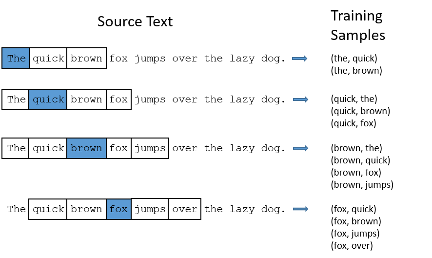
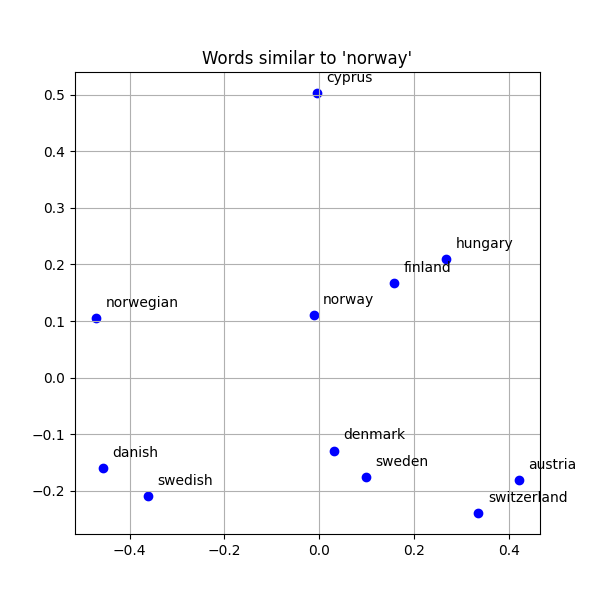
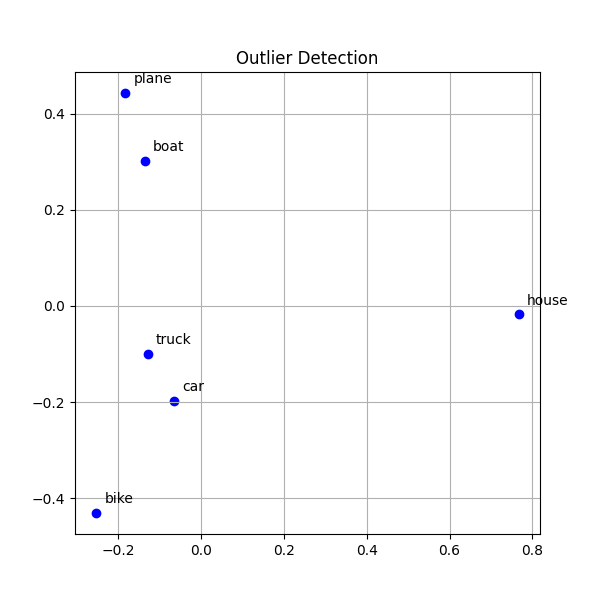
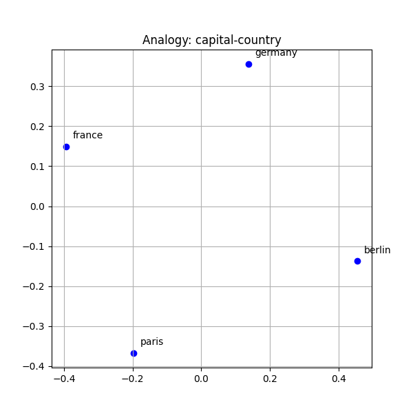
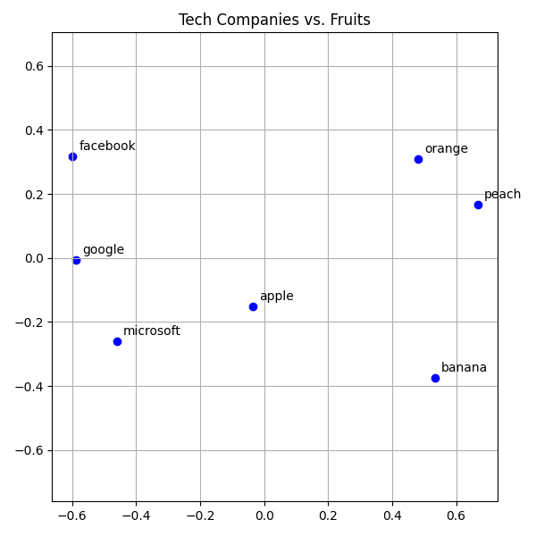

# Scaling Up – From Our Toy Model to GloVe

## Comparing Our Toy Model to GloVe

When we talk about language models, we often hear words like:

* **Token** – not always a full word. Often it’s a sub-word piece (prefix, root, suffix). Think of it like a syllable.
* **Training data** – the number of tokens the model saw during training.
* **Parameters** – the learned weights and biases.

For our **tiny 3D model**:

* Vocabulary size = **10 words**
* Embedding size = **3 dimensions**
* Parameters = **30** (10 × 3)
* Training = **24 tokens** (12 word pairs)

Compare that to **GloVe**:

* Vocabulary size = **400,000 words**
* Embedding size = **300 dimensions**
* Parameters = **120 million** (400k × 300)
* Training = up to **840B tokens**

For perspective: English dictionaries like Merriam-Webster list ~470,000 words

---

## How Training Data Is Created

Given a specific word in the middle of a sentence, the model looks at its neighbors in a context window. This builds up co-occurrence statistics: which words tend to show up together.

Example: *“The quick brown fox jumps over the lazy dog.”*
With a context window of 2, the input word `fox` gets paired with `quick`, `brown`, `jumps`, `over`.

For the 2024 GloVe models, a symmetric context window of size 10 was used to define co-occurrences.

---

## GloVe: Global Vectors for Word Representation

**GloVe 2024 – Dolma**

* Size: 4.8 GB
* Training:  220B tokens, web content, including code, text, and data
* Dimensions: 300
* [Download link](https://nlp.stanford.edu/data/wordvecs/glove.2024.dolma.300d.zip)

**GloVe 2024 – Wikigiga**

* Size: 842 MB – 5.1 GB
* Training: 12B token, Wikipedia and newswire text data
* Dimensions: 50, 100, 200, 300
* [Download links](https://nlp.stanford.edu/data/wordvecs/)

The **smallest model** has 1.29M rows × 50 columns.
Preprocessing (restrict to the most frequent 255K words) reduces it to 152 MB (fits in RAM on a laptop).

---

## Demos with GloVe

For these demos, we’ll use the **50D Wikipedia model**.
Remember: these are not dictionaries or thesauri — they capture *statistical relatedness*.

---

### Demo 1: Similarities

Find the 10 most similar words to a given input word.

```python
def most_similar(v: dict[str, np.ndarray], word: str, top_k: int = 10):
    sims = []
    if target := v.get(word):
        for w, vec in v.items():
            if w != word:
                similarity = np.dot(target, vec)  # cosine similarity (normalized)
                if len(sims) < top_k or similarity > sims[-1][0]:
                    sims.append((similarity, w))
                    sims.sort(reverse=True, key=lambda x: x[0])
    return sims
```

Example: words similar to **`norway`**

* denmark: 0.8731
* sweden: 0.8479
* norwegian: 0.8274
* finland: 0.8236
* hungary: 0.7779
* danish: 0.7703
* austria: 0.7694
* cyprus: 0.7668
* swedish: 0.7556
* switzerland: 0.7530

GloVe vectors projected into 2D:



---

### Demo 2: Finding the Outlier

Given a list of words, find the one least related to the group.

```python
def outlier(v: dict[str, np.ndarray], words: list[str]) -> str:
    mean_vector = np.mean([v[word] for word in words], axis=0)
    mean_vector /= np.linalg.norm(mean_vector) # normalize
    return min(words, key=lambda w: np.dot(v[w], mean_vector))
```

Example: `["car", "truck", "house", "bike"]`
Outlier: **`house`**



---

### Demo 3: Analogy

The classic showcase: *“Berlin is to Germany as Paris is to ?”*

```python
def analogy(v: dict[str, np.ndarray], words: list[str]) -> str:
    target = v[words[2]] - v[words[0]] + v[words[1]] # e.g.: KING - QUEEN == MAN - WOMAN
    target /= np.linalg.norm(target)
    return max(v.keys(), key=lambda w: np.dot(v[w], target) if w not in words else -1)
```

Example: `["berlin", "germany", "paris"]`
Answer: **`france`**



---

### Limits of GloVe (Why It’s Not Enough)

GloVe is powerful — it groups similar words together, but also shallow: it only uses co-occurrence statistics.
Words like apple are ambiguous: fruit vs. company
GloVe can’t separate those meanings → "apple" might sit awkwardly between fruits and tech companies.
No context → the model doesn’t know if “apple is delicious” vs. “Apple released iOS 19.”



See how the fruits and tech companies are kind of in the same space?
That's because GloVe has only one vector per word. It doesn’t know whether we’re talking about ‘Apple the fruit’ or ‘Apple the company.’
This is the weakness of static embeddings. It’s why newer models, like transformers, moved to contextual embeddings — where the meaning of a word changes depending on the sentence.

Contextual embeddings. Models like BERT and GPT don’t give you one fixed vector — they generate a vector that changes depending on the sentence. That’s where we’ll go next.”

---

### Key Takeaway

* Our **toy model** showed the mechanics.
* GloVe **scales this idea** to hundreds of thousands of words and hundreds of dimensions.
* The geometry encodes meaning: *similarity, clustering, analogies*.
