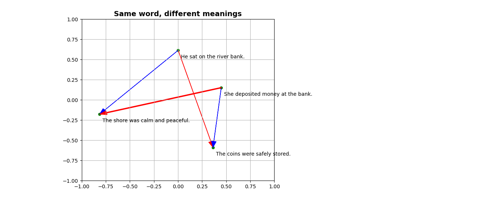

# Transformer Models

With GloVe, every word had **one fixed vector**.
That’s powerful, but also limiting: words like *bank* or *apple* are forced to live a double life.

Transformers fix this by creating **contextual embeddings**:
every time a word appears, the model generates a fresh vector for it, shaped by the surrounding words.

Instead of processing text word by word, transformers look at the **whole context window at once**, using a mechanism called *attention* to decide which words matter most for each other.

---

#### Example: Word Sense

*“I arrived at the bank after crossing the …”*

- If the last word is **river**, then *bank* means *riverbank*.
- If the last word is **road**, then *bank* means *financial institution*.

Static embeddings blur these meanings together.
Transformers separate them dynamically — *bank* gets a different vector in each sentence.

---

#### Example: Pronoun Resolution (optional)

1. *“The animal didn’t cross the street because **it** was too tired.”*
   → **it = animal**

2. *“The animal didn’t cross the street because **it** was bustling.”*
   → **it = street**

Same structure, different meaning.
Transformers use attention to track these shifts.

---

### Demo 1: Same word, different meanings

- He sat on the river bank.
- She deposited money at the bank.
- The shore was calm and peaceful.
- The coins were safely stored.

Showing that the transformer correctly identifies that *bank* in the first sentence is more related to *shore*, while *bank* in the second sentence is more related to *coins stored*.

```python
""" Same word, different meanings (Transformers vs GloVe) """
from sentence_transformers import SentenceTransformer, util

# Load a small pre-trained transformer
model = SentenceTransformer("all-MiniLM-L6-v2")

sentences = [
    "He sat on the river bank.",
    "She deposited money at the bank.",
    "The shore was calm and peaceful.",
    "The coins were safely stored."
]

# Encode full sentences
vec = model.encode(sentences)

# Cosine similarity
s0 = util.cos_sim(vec[0], vec[2])
s1 = util.cos_sim(vec[0], vec[3])
s2 = util.cos_sim(vec[1], vec[2])
s3 = util.cos_sim(vec[1], vec[3])
print(f"Similarity ((river) bank, shore): {s0.item():.4f}")
print(f"Similarity ((river) bank, coins stored): {s1.item():.4f}")
print(f"Similarity ((money) bank, shore): {s2.item():.4f}")
print(f"Similarity ((money) bank, coins stored): {s3.item():.4f}")
```

```text
Similarity ((river) bank, shore): 0.2335
Similarity ((river) bank, coins stored): 0.2088
Similarity ((money) bank, shore): 0.0888
Similarity ((money) bank, coins stored): 0.4289
```



(blue distances are shorter = more similar)
---

#### What’s Stored in a Transformer?

If a new vector is generated every time, what actually lives inside the model?

- **Token embeddings (starting point):** each token has an initial learned vector.
- **Parameters (the recipe):** millions or billions of weights in the attention layers and feed-forward networks.
- **Positional encodings:** information about where each token appears in the sequence.

What’s *not* stored: two versions of *bank*.
Instead, the model **computes the right vector on the fly**, using context.

Think of GloVe as a **dictionary**: one fixed definition per word.
Think of transformers as a **recipe book**: the rules (weights) are stored, and each time you see a word, the model cooks up a new dish (vector) using the surrounding words as ingredients.

---

#### Scaling Up

- **GloVe (2014)**
  - Based on co-occurrence statistics of words in text
  - Embeddings up to 300 dimensions
  - One static vector per word

- **BERT (2018)**
  - Context window: 512 tokens
  - 12 layers, 768 dimensions

- **GPT-3 (2020)**
  - Context window: 2,048 tokens
  - 96 layers, 12,288 dimensions

- **Modern Transformers (GPT-4, GPT-5)**
  - Context windows >100,000 tokens
  - Large numbers of layers and dimensions
  - Can handle books or long conversations in a single pass

---

### Demo: Question Answering with Sentence Transformers

Because transformers produce **sentence-level embeddings**, we can do more than word similarity.
We can ask a question, and simply retrieve the sentence that’s closest in meaning.

```python
from sentence_transformers import SentenceTransformer, util

# Load model
model = SentenceTransformer("all-MiniLM-L6-v2")

# Example sentences (like snippets from Treasure Island)
sentences = [
    "Jim Hawkins is the narrator of Treasure Island.",
    "Long John Silver is a cunning one-legged pirate.",
    "They set sail to find buried treasure.",
    "The Squire and the Doctor organized the voyage.",
    "The crew had mixed loyalties."
]

# Encode the sentences once
sentence_embeddings = model.encode(sentences, convert_to_tensor=True)

print("Ask me questions about Treasure Island! (type 'exit' to quit)\n")
while True:
    # Get user input
    question = input("Question: ")
    if question.lower().strip() in {"exit", "quit"}:
        print("Goodbye!")
        break

    # Encode the question
    question_embedding = model.encode(question, convert_to_tensor=True)

    # Compute cosine similarities, find the print best match
    cos_sim = util.cos_sim(question_embedding, sentence_embeddings)
    best_idx = cos_sim.argmax().item()
    print(f"Best Answer: {sentences[best_idx]}\n")
```

```text
Ask me questions about Treasure Island! (type 'exit' to quit)

Question: Who is the villain?
Best Answer: Long John Silver is a cunning one-legged pirate.

Question: Who planed the trip?
Best Answer: The Squire and the Doctor organized the voyage.

Question: Who is the storyteller?
Best Answer: Jim Hawkins is the narrator of Treasure Island.

Question: Tell me about the gang.
Best Answer: The crew had mixed loyalties.

```

---

Final Demo: From Vectors to Language

```python
""" Simple example of using SentenceTransformers and HuggingFace Transformers."""
from transformers import pipeline

generator = pipeline("text-generation", model="gpt2")
prompt = "Not all heroes"
print("Start:", prompt)

for _ in range(10):  # number of steps to grow the sentence
    outputs = generator(
        prompt,
        max_new_tokens=1,   # just one token at a time
        num_return_sequences=1,
        temperature=2.5,    # higher = more random, lower = more greedy
        do_sample=False     # always take the most likely next token
    )
    prompt = outputs[0]["generated_text"]
    print("→", prompt)
```

**Not all heroes**

```text
Device set to use mps:0
Start: Not all heroes
The following generation flags are not valid and may be ignored: ['temperature']. Set `TRANSFORMERS_VERBOSITY=info` for more details.
Setting `pad_token_id` to `eos_token_id`:50256 for open-end generation.
→ Not all heroes are
Setting `pad_token_id` to `eos_token_id`:50256 for open-end generation.
→ Not all heroes are created
Setting `pad_token_id` to `eos_token_id`:50256 for open-end generation.
→ Not all heroes are created equal
Setting `pad_token_id` to `eos_token_id`:50256 for open-end generation.
→ Not all heroes are created equal.
Setting `pad_token_id` to `eos_token_id`:50256 for open-end generation.
→ Not all heroes are created equal. Some
Setting `pad_token_id` to `eos_token_id`:50256 for open-end generation.
→ Not all heroes are created equal. Some are
Setting `pad_token_id` to `eos_token_id`:50256 for open-end generation.
→ Not all heroes are created equal. Some are better
Setting `pad_token_id` to `eos_token_id`:50256 for open-end generation.
→ Not all heroes are created equal. Some are better than
Setting `pad_token_id` to `eos_token_id`:50256 for open-end generation.
→ Not all heroes are created equal. Some are better than others
Setting `pad_token_id` to `eos_token_id`:50256 for open-end generation.
→ Not all heroes are created equal. Some are better than others.
```

**Not all heroes are created equal. Some are better than others.**

## From Vectors to ChatGPT

The journey from simple word vectors to powerful AI like ChatGPT:

* Words → Numbers (embeddings)
* Numbers → Relationships (similarity, clusters, analogies)
* Relationships + Context → Understanding (transformers)

